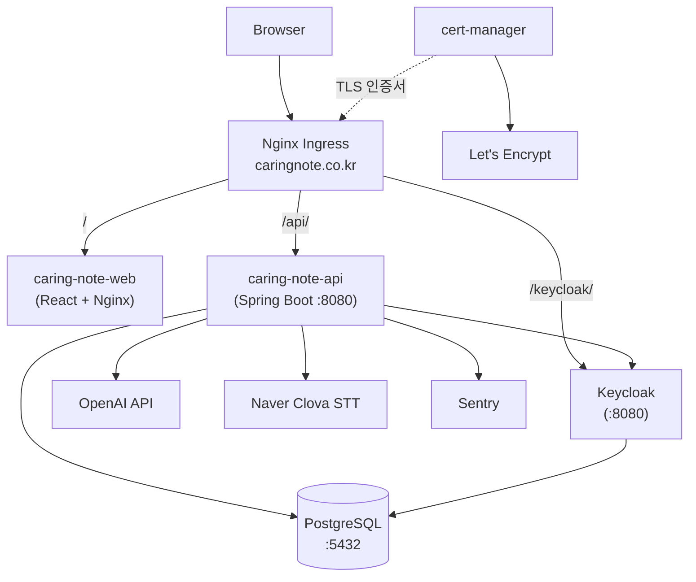
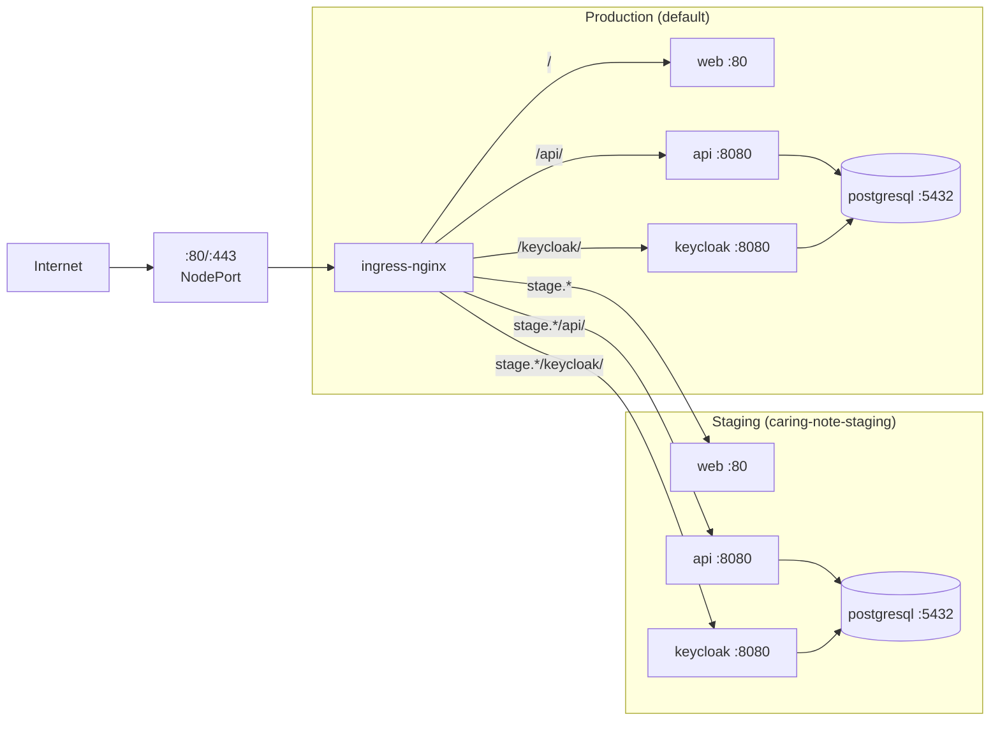
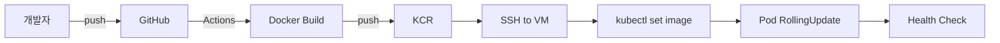

# 케어링 노트 배포 및 인프라

케어링 노트 서비스의 Kubernetes 배포 매니페스트, Helm 차트 설정, CI/CD 파이프라인을 관리하는 저장소입니다.

## 환경 정보

| 환경 | 도메인 | VM IP | K8s Namespace |
|------|--------|-------|---------------|
| **Production** | caringnote.co.kr | 61.109.237.168 | `default` |
| **Staging** | stage.caringnote.co.kr | 210.109.53.166 | `caring-note-staging` |

- **클라우드**: 카카오 클라우드 VM (t1i.xlarge: 4 vCPU, 16GB RAM, 1024GB SSD)
- **구성**: 각 환경 별도 VM, 단일 노드 Kubernetes
- **레지스트리**: `medi-bird.kr-central-2.kcr.dev` (Kakao Container Registry)

## 시스템 아키텍처



<details>
<summary>PNG 버전 (Mermaid 미지원 환경용)</summary>


</details>

## 네트워크 구성도



<details>
<summary>PNG 버전 (Mermaid 미지원 환경용)</summary>


</details>

## CI/CD 파이프라인



| 저장소 | 트리거 | 운영 워크플로우 | 스테이징 워크플로우 |
|--------|--------|-----------------|---------------------|
| caring-note-api-server | push to branch | `main.yaml` (push to main) | `staging.yaml` (push to staging) |
| caring-note-web | push/merge to branch | `deployment-main.yml` (PR merge to main) | `deployment-staging.yml` (push to staging) |
| caring-note-keycloak-theme | push to branch | `build.yml` (push to main) | `build.yml` (push to develop) |
| caring-note-deployment | manual dispatch | `deploy-secrets.yml` | `deploy-secrets.yml` |

## 디렉터리 구조

```
📦 caring-note-deployment
├── common/
│   ├── cluster-issuer.yaml         # cert-manager ClusterIssuer
│   ├── get_helm.sh                 # Helm 설치 스크립트
│   ├── helm_list.sh                # 클러스터 기본 환경 설치 ⭐
│   ├── ingress-values.yaml         # nginx-ingress 설정
│   ├── keycloak-values.yaml        # Keycloak Helm 설정
│   ├── network-policy.yaml         # (미사용) NetworkPolicy
│   └── postgresql/                 # PostgreSQL Helm 차트
├── pvc/
│   ├── postgresql-pv-prod.yaml     # PV (Production: /mnt/data, 16Gi)
│   └── postgresql-pv-staging.yaml  # PV (Staging: /mnt/data/postgresql-staging, 100Gi)
├── prod/                           # 프로덕션 매니페스트 ⭐
│   ├── api.yaml
│   ├── ingress.yaml
│   └── web.yaml
├── staging/                        # 스테이징 매니페스트 ⭐
│   ├── api.yaml
│   ├── deploy-staging.sh
│   ├── ingress.yaml
│   └── web.yaml
└── docs/                           # 운영 문서
```

**주요 설계**:
- PostgreSQL/Keycloak values 파일은 환경 공통, 차이는 Helm `--set`으로 주입
- Secret 참조 방식 통일 (Git에 평문 비밀번호 미저장)

## K8s 클러스터 설정

```bash
# k8s는 사전 설치되어 있다고 가정
git clone https://github.com/MediBird/caring-note-deployment.git
cd caring-note-deployment

# Helm 설치
./common/get_helm.sh

# 클러스터 기본 환경 설정 (PostgreSQL, Keycloak, Ingress, cert-manager)
./common/helm_list.sh
```

## Kubernetes Secrets 관리

민감한 정보(비밀번호, API Key 등)를 Kubernetes Secrets로 관리합니다.

### GitHub Actions를 통한 자동 배포

```bash
# GitHub Repository > Actions > Deploy Kubernetes Secrets
# environment 선택: staging 또는 production
```

자동 생성되는 Secrets (동일 이름, namespace로 분리):
- **Staging** (`caring-note-staging`): `kcr-secret`, `api-secret`, `postgresql`, `keycloak`, `keycloak-externaldb`
- **Production** (`default`): `kcr-secret`, `api-secret`, `postgresql`, `keycloak`, `keycloak-externaldb`

### TLS Certificate Secrets

**Production**: `caringnote-tls` — Let's Encrypt SSL 인증서 (caringnote.co.kr)

**Staging**:
1. DNS: `stage.caringnote.co.kr` → Staging VM Public IP
2. cert-manager가 자동으로 인증서 발급 (`staging/ingress.yaml`에 설정됨)
3. 확인: `kubectl get certificate -n caring-note-staging`

자세한 내용은 위 Secret 추가 운영 가이드를 참고하세요.

---

### 새로운 Secret 추가 운영 가이드

API 서버에 새로운 환경변수(Secret)를 추가할 때의 전체 과정입니다.

#### 예시: SENTRY_DSN 추가

##### 1단계: GitHub Secrets 등록

1. **caring-note-deployment** 저장소 > Settings > Secrets and variables > Actions
2. Environment secrets에 추가 (staging/production 각각):
   ```
   Name: SENTRY_DSN
   Value: https://xxx@xxx.ingest.sentry.io/xxx
   ```

##### 2단계: deploy-secrets.yml 수정

`.github/workflows/deploy-secrets.yml`에서 api-secret 생성 부분에 추가:

```yaml
kubectl create secret generic api-secret \
  --from-literal=SPRING_DATASOURCE_USERNAME='${{ secrets.DB_USERNAME }}' \
  --from-literal=SPRING_DATASOURCE_PASSWORD='${{ secrets.DB_PASSWORD }}' \
  --from-literal=OPEN_AI_API_KEY='${{ secrets.OPENAI_API_KEY }}' \
  --from-literal=CLOVA_API_KEY='${{ secrets.CLOVA_API_KEY }}' \
  --from-literal=SENTRY_DSN='${{ secrets.SENTRY_DSN }}' \  # 추가
  --namespace=${NAMESPACE} \
  --dry-run=client -o yaml | kubectl apply -f -
```

##### 3단계: api.yaml에 환경변수 참조 추가

`staging/api.yaml` 및 `prod/api.yaml`의 env 섹션에 추가:

```yaml
- name: SENTRY_DSN
  valueFrom:
    secretKeyRef:
      name: api-secret
      key: SENTRY_DSN
```

##### 4단계: GitHub Actions 워크플로우 실행

1. caring-note-deployment > Actions > **Deploy Kubernetes Secrets**
2. environment 선택 → Run workflow

##### 5단계: VM에서 배포 적용

```bash
ssh <환경별 VM>
cd ~/caring-note-deployment && git pull
kubectl apply -f staging/api.yaml  # 또는 prod/api.yaml
kubectl rollout restart deployment/caring-note-api -n <namespace>
kubectl rollout status deployment/caring-note-api -n <namespace>
```

##### 6단계: 적용 확인

```bash
kubectl get pods -n <namespace>
kubectl exec -n <namespace> deployment/caring-note-api -- env | grep SENTRY
```

#### 주의사항

- **순서 중요**: GitHub Secrets → deploy-secrets 실행 → git pull → kubectl apply → rollout restart
- **api.yaml 변경 필수**: Secret에 값이 있어도 api.yaml에서 참조하지 않으면 Pod에 전달 안 됨
- **Pod 재시작 필수**: Deployment 적용 후 기존 Pod는 새 환경변수를 인식하지 못함

---

## 데이터베이스

- **버전**: PostgreSQL 16+ (Bitnami Helm)
- **DB명**: `caring_note`
- **유저**: `caringnote` (API 접속용), `postgres` (관리용)
- **스토리지**: Production 16Gi, Staging 100Gi

초기 설정 및 스키마 이관 가이드: [docs/DB_SETUP_GUIDE.md](docs/DB_SETUP_GUIDE.md)

---

## 주의사항

* 현재 단일 인스턴스로 Load Balancer를 사용하지 않아 `ingress-values.yaml`에서 NodePort로 설정:

  ```yaml
  type: NodePort ## Load Balancer 사용 시 LoadBalancer로 변경
  ```

---

## 공통 개발 규칙

### 브랜치 전략

- `main`: 운영 배포 브랜치
- `staging`: 스테이징 배포 브랜치
- `feature/*`: 기능 개발 → staging으로 PR

### 커밋 메시지

```
<type>(<scope>): <subject>

feat: 새로운 기능
fix: 버그 수정
docs: 문서 변경
style: 코드 포맷팅
refactor: 리팩토링
test: 테스트
chore: 빌드/설정 변경
```

### PR 프로세스

1. feature 브랜치에서 작업
2. staging으로 PR 생성
3. 리뷰어 1명 이상 승인
4. staging에서 테스트 확인
5. staging → main PR 생성 및 머지 (운영 배포)

### 리뷰어 체크리스트

- [ ] 코드 컨벤션 준수
- [ ] 테스트 코드 포함
- [ ] 보안 취약점 확인
- [ ] 성능 영향 검토
- [ ] 문서 업데이트 필요 여부

---

## 관련 저장소

| 저장소 | 설명 |
|--------|------|
| [caring-note-api-server](https://github.com/MediBird/caring-note-api-server) | Spring Boot API 서버 |
| [caring-note-web](https://github.com/MediBird/caring-note-web) | React 웹 프론트엔드 |
| [caring-note-keycloak-theme](https://github.com/MediBird/caring-note-keycloak-theme) | Keycloak 커스텀 테마 |
